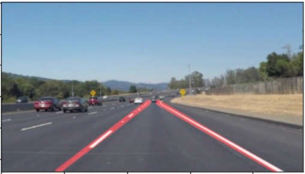

# **Finding Lane Lines on the Road** 

The goals / steps of this project are the following:
* Make a pipeline that finds lane lines on the road
* Reflect on the work in a written report

[//]: # (Image References)

[image1]: ./examples/grayscale.jpg "Grayscale"

---

### Reflection

### 1. Describe your pipeline. As part of the description, explain how you modified the draw_lines() function.

My pipeline consisted of 4 steps which are implemented inside one method called **getImageWithLines**:

**Step 1.** In this step, I created an image with masked edges from the original image. To do that, first, the original image was converted to gray scale and blurred with (5x5) kernel, and second, canny algorithm was applied to create an image with edges only.

  

**Step2:** In this step, I selected a region of interest from the edges that should contain the lanes we are looking for. 

**Step3:** In this step, an image with two lines running along the two lanes were created. First, Hough Lines were constructed on the selected region. This gave us a set of lines, which is fed to **draw_lines** method. To find a single left lane line and a single right lane line, I developed this algorithm, which was called inside draw_lines:

1. divide the Hough lines into two sets based on the sign of their slopes: leftLines and rightLines. 
2. Now for each set, I filtered out the lines that do not have a slope in an expected slope range and an intercept in an expected intercept range. Filtering with a range of expected slope gets rid of lines which runs close to horizontal or vertical directions. Filtering with a range of intercepts gets right of parallel lines.
3. Then I took the average slope and intercept for each of the filtered set and constructed one line for each set.

This modification produces the image on the right instead of the image on the left.

These two new lines were drawn on a black canvas called **lines_img**.

**Step 4:** Finally, the original image and the lines_img were combined with proper weights to make both the lanes and the lines visible on a single image.

    + 
 = 
 

### 2. Identify potential shortcomings with your current pipeline

There are a lot of short-comings in this solution. Here I am enlisting a few of those.

One potential shortcoming would be what would happen when the broken lines on a lane are too small or worn out. I set the minimum acceptable length for a line to 20 pixels. So, if there are no line in the selected region of interest which are long enough, we will end up losing a lane line. 

Another shortcoming is the algorithm assumes a fixed position of the camera with respect to the lane positions, and chooses a region of interest based on that. So, it's possible to have lanes that might not be always in the selected region, because the vehicle can move laterally, change the heading, or hit a bump. 

Another great shortcoming is that this algorithm will probably only work in a sunny day and without shades on the roads. The edge detection algorithms depend on the parameters chosen on the basis of the sample inputs for this project only.

Another short coming is if there is a preceding vehicle which have lines resembiling the lanes, or high contrasting surfaces of roads running in parallel to the lanes, it may falsely identify them as lane lines. Though I implemented filtering with expected intercept, it will still fail as such lines may also pass the intercept test. 

I didn't check whether the two lane lines will intersect inside the region of interest. I may happen while taking a curve. When then need to shorten the lines. You can see crossing of lines in the optional challenge.

### 3. Suggest possible improvements to your pipeline

A possible improvement would be to consider the sequence of the images to adapt region of interest and predict possible lane lines for future image frames. This can help with disturbances and noises. Even if line detection fails in an image, it's possible to predict where the lines should be from previous images.

Another potential improvement could be to analyze the image first based on color intensity to predict the time of the day and adjust parameters for edge detection based on that. 

There can be more robust filtering of lines based on the road surfaces. High constrasts in the surface may lead to a lot of lanes lanes detected.